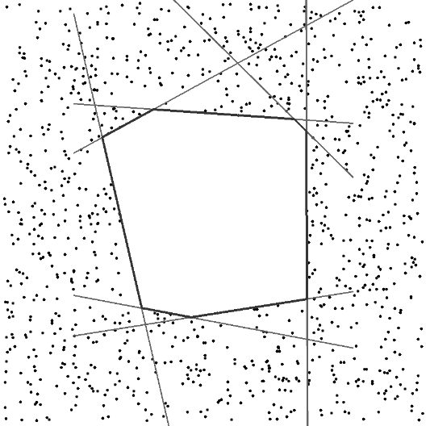

# Generating Large Convex Polytopes Directly on Point Clouds (2D)
This repository contains the implementation of 2D version of **Galaxy**, which generate polyhedrons efficiently on point clouds.

<<<<<<< HEAD
## Publication

If you use our implementation in your academic work, please cite the corresponding [paper](https://arxiv.org/pdf/2010.08744.pdf):  
    
@article{zhong2020generating,
  title={Generating large convex polytopes directly on point clouds},
  author={Zhong, Xingguang and Wu, Yuwei and Wang, Dong and Wang, Qianhao and Xu, Chao and Gao, Fei},
  journal={arXiv preprint arXiv:2010.08744},
  year={2020}
}
=======

_An example of output:_

>>>>>>> 29982d320c3b6a155ae00b0749085a7abf8210a2

## Dependencies
1. Eigen
2. OpenCV

## Build
<<<<<<< HEAD
''' bash
=======
``` bash
>>>>>>> 29982d320c3b6a155ae00b0749085a7abf8210a2
mkdir build && cd build
cmake ..
make 
./demo
<<<<<<< HEAD
'''
=======
```
## Publication

If you use our implementation in your academic work, please cite the corresponding [paper](https://arxiv.org/pdf/2010.08744.pdf):  
    
    @article{zhong2020generating,
             title={Generating large convex polytopes directly on point clouds},
             author={Zhong, Xingguang and Wu, Yuwei and Wang, Dong and Wang, Qianhao and Xu, Chao and Gao, Fei},
             journal={arXiv preprint arXiv:2010.08744},
             year={2020}
    }
>>>>>>> 29982d320c3b6a155ae00b0749085a7abf8210a2
